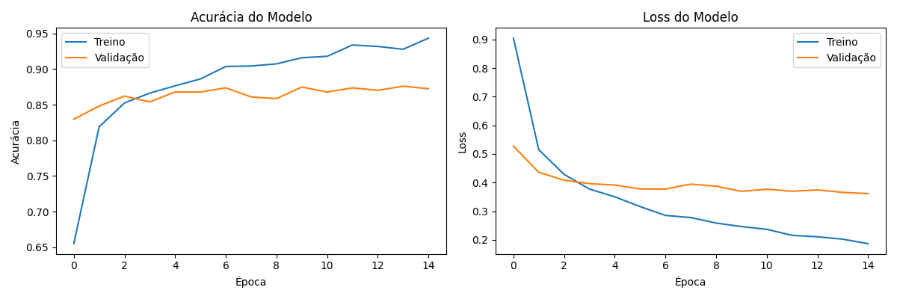
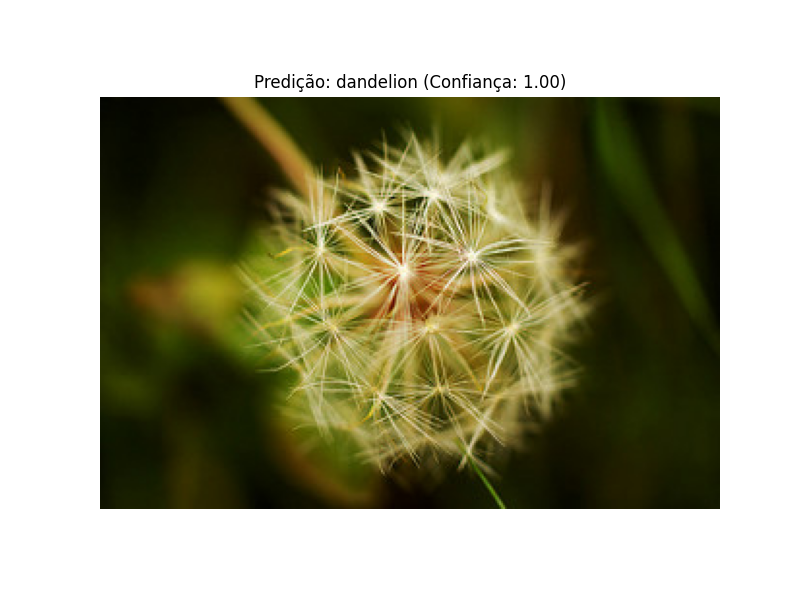
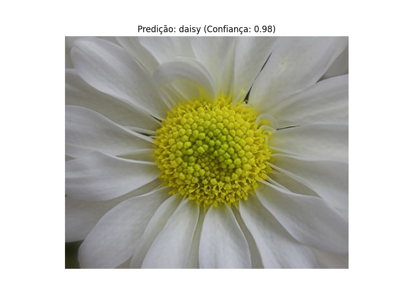
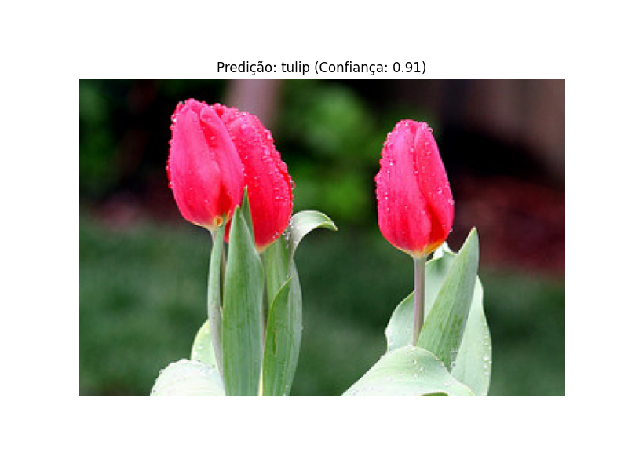
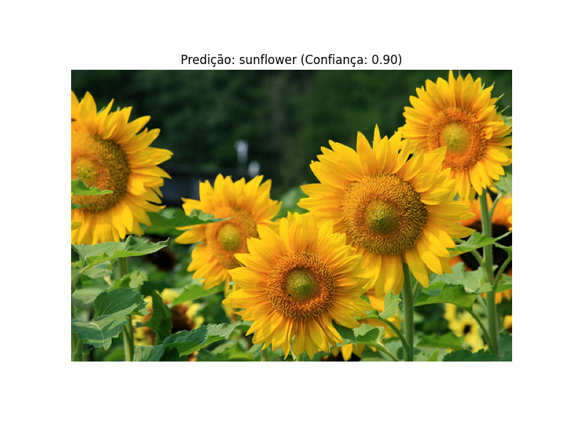
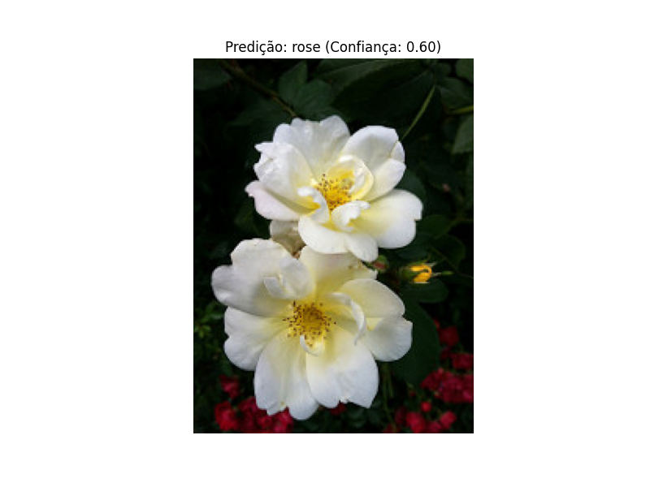

# Relatório Final - Sistema de Reconhecimento de Espécies de Plantas

**Repositório:** https://github.com/fabiobr05/Classifier_flowers.git

## 1. Introdução

Este projeto implementa um sistema de reconhecimento automático de espécies de plantas utilizando técnicas de visão computacional e deep learning. O objetivo é classificar imagens de flores em cinco categorias: margarida (daisy), dente-de-leão (dandelion), rosa (rose), girassol (sunflower) e tulipa (tulip).

## 2. Dataset

**Fonte:** Kaggle - Flowers Recognition Dataset  
**URL:** https://www.kaggle.com/datasets/alxmamaev/flowers-recognition  
**Composição:** 4.317 imagens distribuídas em 5 classes  
**Formato:** Imagens coloridas em diferentes resoluções  
**Divisão:** 70% treino, 20% validação, 10% teste  

### Distribuição das Classes
- Daisy: ~633 imagens
- Dandelion: ~898 imagens  
- Rose: ~641 imagens
- Sunflower: ~699 imagens
- Tulip: ~799 imagens

## 3. Metodologia

### 3.1 Pré-processamento
- **Redimensionamento:** Todas as imagens foram redimensionadas para 224x224 pixels
- **Normalização:** Valores de pixel normalizados para o intervalo [0,1]
- **Conversão de formato:** BGR para RGB para compatibilidade

### 3.2 Arquiteturas Testadas

#### 3.2.1 CNN Simples
- **Arquitetura:** 3 camadas convolucionais + 2 camadas densas
- **Parâmetros:** 32, 64, 128 filtros; MaxPooling; Dropout 0.5
- **Resultado:** 60.1% de acurácia

#### 3.2.2 CNN com Data Augmentation
- **Melhorias:** Rotação (±10°), zoom (±10%), flip horizontal, ajuste de contraste
- **Resultado:** 65.7% de acurácia (+5.6% melhoria)

#### 3.2.3 Transfer Learning (MobileNetV2)
- **Base:** MobileNetV2 pré-treinada no ImageNet
- **Customização:** Camadas superiores congeladas + classificador personalizado
- **Data Augmentation:** Aplicada
- **Resultado:** 86.1% de acurácia (melhor modelo)

### 3.3 Hiperparâmetros
- **Otimizador:** Adam (learning_rate=0.001)
- **Função de Loss:** Categorical Crossentropy
- **Batch Size:** 32
- **Épocas:** 15 (com Early Stopping)
- **Callbacks:** EarlyStopping (patience=5), ReduceLROnPlateau (factor=0.2)

## 4. Resultados

### 4.1 Comparação de Modelos

| Modelo | Acurácia | Melhoria |
|--------|----------|----------|
| CNN Simples | 60.1% | Baseline |
| CNN + Augmentation | 65.7% | +5.6% |
| Transfer Learning | **86.1%** | +26.0% |

### 4.2 Evolução do Treinamento



**Observações:**
- Convergência estável sem overfitting significativo
- Validação acompanha o treinamento indicando boa generalização
- Early stopping ativado para evitar sobreajuste

<br>
<br>
<br>
<br>
<br>

### 4.3 Resultados por Espécie

| Espécie | Acurácia | Imagem |
|---------|----------|--------|
| Dandelion | 100% |  |
| Daisy | 98% |  |
| Tulip | 91% |  |
| Sunflower | 90% |  |
| Rose | 60% |  |

### 4.4 Performance Final
- **Acurácia no conjunto de teste:** 86.1%
- **Modelo selecionado:** Transfer Learning com MobileNetV2
- **Tempo de treinamento:** ~15 épocas (com early stopping)

## 5. Implementação

### 5.1 Estrutura do Projeto
```
visao_computacional/
├── data/
│   ├── raw/flowers/          # Dataset original
│   ├── processed/            # Dados processados
│   └── results/              # Modelos treinados
├── src/
│   ├── preprocessing/        # Pré-processamento de imagens
│   ├── algorithms/           # Classificadores (CNN e tradicional)
│   ├── utils/               # Utilitários (carregamento, download)
│   └── visualization/       # Visualização de resultados
├── requirements.txt         # Dependências
└── main.py                 # Script principal
```

### 5.2 Tecnologias Utilizadas
- **Python 3.8+**
- **TensorFlow 2.8+** - Deep learning framework
- **OpenCV 4.5+** - Processamento de imagens
- **scikit-learn 0.24+** - Métricas e modelo tradicional
- **Matplotlib 3.3+** - Visualização
- **KaggleHub** - Download automático do dataset

### 5.3 Funcionalidades Implementadas
- Download automático do dataset via Kaggle API
- Pré-processamento automatizado de imagens
- Treinamento comparativo de múltiplas arquiteturas
- Visualização da evolução do treinamento
- Interface interativa para escolha de modelo
- Sistema de predição com confiança

## 6. Conclusões

### 6.1 Principais Achados
1. **Transfer Learning** demonstrou superioridade significativa (86.1% vs 60.1%)
2. **Data Augmentation** proporcionou melhoria consistente (+5.6%)
3. **MobileNetV2** mostrou-se eficaz para classificação de flores
4. **Divisão adequada** dos dados evitou overfitting

### 6.2 Limitações
- Dataset relativamente pequeno para deep learning
- Desbalanceamento leve entre classes
- Dependência de características visuais específicas

### 6.3 Trabalhos Futuros
- Teste com arquiteturas mais robustas (ResNet, EfficientNet)
- Implementação de ensemble methods
- Expansão para mais espécies de plantas
- Otimização para deployment em dispositivos móveis

## 7. Código-fonte

O código completo está disponível no repositório do projeto, incluindo:

- **Scripts de pré-processamento:** `src/preprocessing/image_processor.py`
- **Modelos de treinamento:** `src/algorithms/cnn_classifier.py`
- **Avaliação:** Métricas integradas no pipeline de treinamento
- **Utilitários:** Download automático e carregamento de dados

### Execução
```bash
# Instalar dependências
pip install -r requirements.txt

# Executar sistema
python src/main.py

# Escolher opção 1 para CNN (recomendado)
```

## 8. Referências

1. Kaggle Flowers Recognition Dataset - https://www.kaggle.com/datasets/alxmamaev/flowers-recognition
2. MobileNetV2: Inverted Residuals and Linear Bottlenecks - Sandler et al., 2018
3. TensorFlow Documentation - https://www.tensorflow.org/
4. OpenCV Documentation - https://docs.opencv.org/

---

**Autor:** Fabio Batista Rodrigues <br>
**Data:** 2025/12/04 <br>
**Disciplina:** Visão Computacional  <br>
**Instituição:** Universidade Federal de Mato Grosso do Sul
